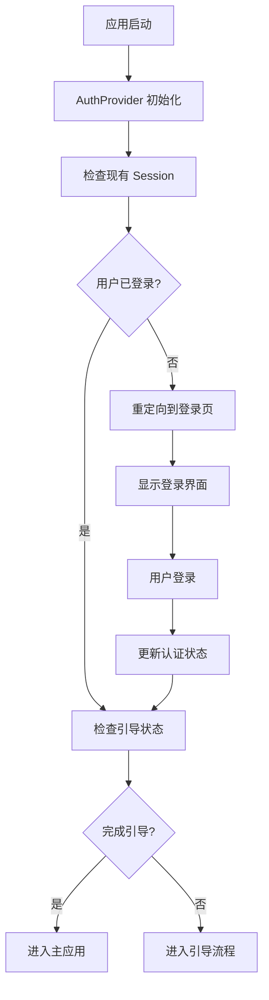

# 认证系统架构文档

## 概述

本项目实现了一个完整的基于 Supabase 的认证系统，包括 session 管理、路由保护和用户状态管理。

## 系统架构

### 1. 核心组件

#### AuthContext (`src/contexts/AuthContext.tsx`)
- **功能**: 提供全局认证状态管理
- **特性**:
  - 自动监听 Supabase 认证状态变化
  - 提供登录、注册、登出等认证方法
  - 支持 Apple 登录
  - 自动持久化 session 到 AsyncStorage

#### AuthGuard (`src/components/AuthGuard.tsx`)
- **功能**: 路由保护组件
- **组件**:
  - `AuthGuard`: 保护需要认证的路由
  - `GuestGuard`: 保护游客路由（已登录用户不能访问）

#### 认证中间件 (`src/utils/authMiddleware.ts`)
- **功能**: 路由权限检查和重定向逻辑
- **特性**:
  - 自动检查路由权限
  - 智能重定向
  - 支持公开、受保护和游客路由

### 2. 路由保护配置

```typescript
export const ROUTE_CONFIG = {
  // 需要认证的路由
  PROTECTED_ROUTES: [
    '/tabs',
    '/ChatScreen',
    '/styling',
    '/onboarding'
  ],
  // 游客路由（已登录用户不能访问）
  GUEST_ROUTES: [
    '/Login',
    '/signup',
    '/forgot-password'
  ],
  // 公开路由（任何人都可以访问）
  PUBLIC_ROUTES: [
    '/',
    '/index'
  ]
};
```

### 3. 认证流程



## 使用方法

### 1. 在组件中使用认证状态

```typescript
import { useAuth } from '@/contexts/AuthContext';

function MyComponent() {
  const { user, loading, signOut } = useAuth();
  
  if (loading) return <LoadingSpinner />;
  
  return (
    <View>
      <Text>Welcome, {user?.email}!</Text>
      <Button onPress={signOut} title="Sign Out" />
    </View>
  );
}
```

### 2. 保护需要认证的页面

```typescript
import { AuthGuard } from '@/components/AuthGuard';

function ProtectedPage() {
  return (
    <AuthGuard>
      <View>
        <Text>This page requires authentication</Text>
      </View>
    </AuthGuard>
  );
}
```

### 3. 保护游客页面

```typescript
import { GuestGuard } from '@/components/AuthGuard';

function LoginPage() {
  return (
    <GuestGuard>
      <View>
        <Text>Login Page</Text>
      </View>
    </GuestGuard>
  );
}
```

### 4. 使用认证中间件

```typescript
import { useAuthMiddleware } from '@/utils/authMiddleware';

function MyPage() {
  const { user, loading, isAuthenticated, canAccess } = useAuthMiddleware('/tabs');
  
  if (!canAccess) {
    return <Redirect to="/Login" />;
  }
  
  return <YourContent />;
}
```

## 环境配置

### 1. 环境变量

在 `.env` 文件中配置：

```env
EXPO_PUBLIC_SUPABASE_URL=your_supabase_project_url
EXPO_PUBLIC_SUPABASE_ANON_KEY=your_supabase_anon_key
```

### 2. Supabase 配置

确保 Supabase 项目已正确配置：
- 启用 Apple 认证（iOS）
- 配置重定向 URL
- 设置 RLS 策略

## 测试

### 自动测试

系统包含自动测试工具 (`src/utils/authTest.ts`)，在开发环境中会自动运行：

- ✅ Supabase 连接测试
- ✅ Session 状态检查
- ✅ 环境变量验证

### 手动测试流程

1. **未登录状态**:
   - 访问 `/tabs` → 重定向到 `/Login`
   - 访问 `/Login` → 正常显示

2. **已登录状态**:
   - 访问 `/Login` → 重定向到 `/tabs`
   - 访问 `/tabs` → 正常显示

3. **认证流程**:
   - 点击 Apple 登录按钮
   - 完成 Apple 认证
   - 自动重定向到主应用

## 安全特性

1. **自动 Session 管理**: 自动处理 token 刷新和过期
2. **路由保护**: 防止未授权访问
3. **状态持久化**: 使用 AsyncStorage 保存认证状态
4. **错误处理**: 完善的错误处理和用户提示

## 扩展功能

### 添加新的认证方式

1. 在 `AuthContext` 中添加新的认证方法
2. 更新 `Auth.native.tsx` 组件
3. 配置 Supabase 认证提供商

### 自定义路由保护

1. 修改 `ROUTE_CONFIG` 配置
2. 更新 `authMiddleware.ts` 逻辑
3. 在需要的地方使用 `AuthGuard` 或 `GuestGuard`

## 故障排除

### 常见问题

1. **环境变量未加载**:
   - 检查 `.env` 文件是否存在
   - 确认变量名使用 `EXPO_PUBLIC_` 前缀
   - 重启开发服务器

2. **认证状态不更新**:
   - 检查 Supabase 配置
   - 确认网络连接
   - 查看控制台错误信息

3. **路由重定向循环**:
   - 检查路由配置
   - 确认 `AuthGuard` 使用正确
   - 验证认证状态

### 调试工具

使用 `testAuthSystem()` 函数进行系统诊断：

```typescript
import { testAuthSystem } from '@/utils/authTest';

// 手动运行测试
testAuthSystem();
```

## 更新日志

- **v1.0.0**: 初始实现
  - 基础认证系统
  - Apple 登录支持
  - 路由保护
  - Session 管理
